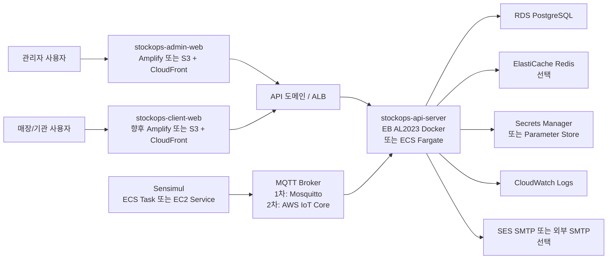
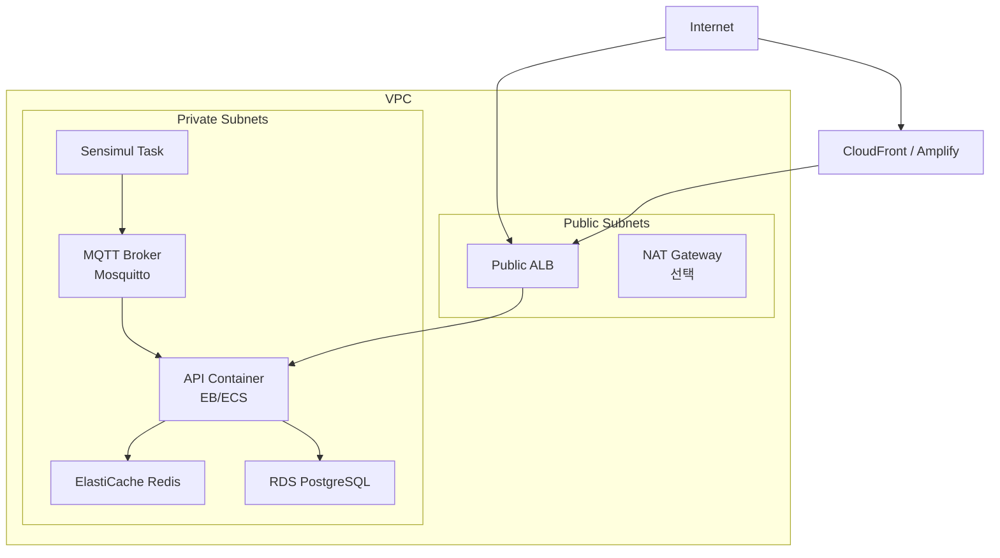

# StockOps AWS 배포 계획

작성일: 2026-05-14  
대상 리전: ap-northeast-2, 서울  
대상 시스템: StockOps 재고 관리 시스템

## 1. 배포 목표

StockOps는 백엔드 API, 관리자 웹, 센서 시뮬레이터, 향후 매장/기관용 클라이언트 웹으로 구성된다. 이번 AWS 배포의 목표는 기존 Elastic Beanstalk 배포 시도에서 확인된 문제를 반영하고, Amazon Linux 2 종료 이슈를 피하면서 운영 가능한 구조로 배포하는 것이다.

핵심 방향은 다음과 같다.

- 백엔드 API는 Amazon Linux 2023 기반 컨테이너 환경에 배포한다.
- 관리자 웹과 향후 클라이언트 웹은 정적 웹 호스팅/CDN 구조로 분리한다.
- 운영 DB는 H2가 아니라 RDS PostgreSQL을 사용한다.
- 센서 데이터는 MQTT 브로커를 통해 수집하고, 초기에는 Mosquitto 기반으로 빠르게 연결한 뒤 필요 시 AWS IoT Core로 전환한다.
- 민감정보는 코드나 문서에 남기지 않고 AWS Secrets Manager 또는 Parameter Store로 관리한다.

## 2. 프로젝트 구성

| 프로젝트 | 경로 | 역할 | 주요 기술 |
|---|---|---|---|
| stockops-api-server | `/Users/hans/Documents/gitlab_workspace/stockops-api-server` | 재고관리 백엔드 API 서버 | Spring Boot 3, Java 21, Docker, PostgreSQL, Flyway, MQTT client, Redis |
| stockops-admin-web | `/Users/hans/Documents/gitlab_workspace/stockops-admin-web` | 관리자용 재고/창고/환경상태 웹 | React, Vite, TypeScript, nginx Dockerfile |
| Sensimul | `/Users/hans/Documents/gitlab_workspace/Sensimul` | 센서 데이터 시뮬레이터 | Go, MQTT, SQLite, Docker |
| stockops-client-web | `/Users/hans/Documents/gitlab_workspace/stockops-client-web` | 향후 매장/기관용 조회 및 발주 웹 | 미구현, 정적 웹 앱 예정 |

## 3. 권장 AWS 서비스

| 영역 | AWS 서비스 | 용도 | 비고 |
|---|---|---|---|
| API 실행환경 | Elastic Beanstalk Docker on AL2023 | Spring Boot API 컨테이너 배포 | 기존 EB 이력을 활용하는 1차 추천안 |
| 대안 API 실행환경 | ECS Fargate + ALB | 장기 운영형 컨테이너 배포 | 서비스가 늘어나면 전환 추천 |
| DB | Amazon RDS for PostgreSQL | 운영 재고/주문/환경 데이터 저장 | Flyway migration 대상 |
| 캐시/Rate Limit | Amazon ElastiCache for Redis | Redis 기반 캐시, rate limit, pub/sub | 기능 사용 여부에 따라 1차 배포에서는 선택 |
| 관리자 웹 | AWS Amplify Hosting 또는 S3 + CloudFront | React/Vite 정적 웹 배포 | EB보다 정적 호스팅이 적합 |
| 클라이언트 웹 | AWS Amplify Hosting 또는 S3 + CloudFront | 향후 매장/기관용 웹 배포 | 관리자 웹과 별도 도메인 권장 |
| 메시지 브로커 1차 | Mosquitto on ECS Fargate 또는 EC2 | Sensimul/API 간 MQTT 송수신 | 코드 변경 최소화 |
| 메시지 브로커 2차 | AWS IoT Core | 실제 센서 연동, 인증서 기반 MQTT | 운영 확장 단계에서 전환 |
| 인증서/DNS | ACM, Route 53 | HTTPS 인증서와 도메인 연결 | API, admin, client 도메인 분리 |
| 로그/모니터링 | CloudWatch Logs, CloudWatch Metrics | 앱 로그, 헬스, 알람 | EB/ECS/RDS 로그 통합 |
| 비밀값 관리 | Secrets Manager 또는 SSM Parameter Store | DB 비밀번호, JWT secret, API key | 환경변수 직접 노출 방지 |
| 이미지 저장소 | Amazon ECR | Docker image registry | ECS 전환 시 필수, EB Docker에도 활용 가능 |

## 4. 권장 애플리케이션 구조



## 5. 네트워크 구조



기본 원칙:

- API는 ALB를 통해서만 외부에 노출한다.
- RDS, Redis, MQTT broker는 private subnet에 둔다.
- 관리자 웹과 클라이언트 웹은 CloudFront/Amplify를 통해 정적 파일만 제공한다.
- API CORS는 실제 웹 도메인만 허용한다.
- 운영 DB 포트는 API 보안그룹에서만 접근 가능하게 제한한다.

## 6. 백엔드 API 배포 계획

1차 추천은 Elastic Beanstalk의 Docker on Amazon Linux 2023 플랫폼이다. 기존 배포 이력이 EB 기반이고, 현재 API 프로젝트에 Dockerfile이 이미 존재하므로 가장 빠르게 운영형 배포로 전환할 수 있다.

배포 시 핵심 환경변수:

```text
SPRING_PROFILES_ACTIVE=prod
STOCKOPS_DATASOURCE_URL=jdbc:postgresql://<rds-endpoint>:5432/stockops
STOCKOPS_DATASOURCE_USERNAME=<secret>
STOCKOPS_DATASOURCE_PASSWORD=<secret>
JWT_SECRET=<secret>
STOCKOPS_CORS_ALLOWED_ORIGINS=https://admin.example.com,https://client.example.com
STOCKOPS_MQTT_INGESTION_ENABLED=true
STOCKOPS_MQTT_INGESTION_BROKER_URL=tcp://<mqtt-broker-private-dns>:1883
SPRING_MAIL_HOST=<smtp-host>
SPRING_MAIL_PORT=<smtp-port>
```

초기 검증 단계에서는 아직 AI/외부 연동이 준비되지 않았다면 다음 기능은 끄고 시작한다.

```text
STOCKOPS_ANALYTICS_ENABLED=false
STOCKOPS_AI_ENABLED=false
GEMINI_ENABLED=false
```

단, 운영 데이터 검증 단계에서는 H2/local 프로필을 사용하지 않는다. RDS PostgreSQL과 `prod` 프로필로 Flyway migration을 통과시키는 것이 운영 배포의 기준이다.

## 7. 기존 EB 배포 이력 반영사항

`stockops-api-server/DEPLOYMENT_HANDOFF.md` 기준 기존 EB 배포 실패의 직접 원인은 네트워크나 보안그룹이 아니라 API 컨테이너 기동 실패였다.

확인된 원인:

- `JWT_SECRET` 기본값이 너무 짧아 `WeakKeyException` 발생
- `local` 프로필의 H2에서 Flyway SQL 문법 오류 발생
- Flyway 비활성화 후 `JavaMailSender` 빈 설정 누락으로 기동 실패
- nginx는 컨테이너의 `8080` 포트를 정상적으로 바라봤으나 Spring Boot 앱이 내려가 있어 `502 Bad Gateway` 발생

운영 배포에서는 다음을 반드시 반영한다.

- 충분히 긴 `JWT_SECRET`을 Secrets Manager 또는 EB 환경변수로 주입한다.
- `local`/H2 검증이 아니라 `prod`/PostgreSQL 검증을 기준으로 삼는다.
- Flyway는 운영에서 활성화하고 전체 migration 성공 여부를 확인한다.
- 메일 기능이 Bean 생성에 필요하므로 SES SMTP 또는 임시 SMTP 값을 명확히 제공한다.
- EB HealthCheckPath는 `/actuator/health`를 유지한다.

## 8. 프론트엔드 배포 계획

`stockops-admin-web`은 Vite 기반 정적 웹 앱이므로 EB보다 정적 호스팅이 적합하다.

권장안:

- 빠른 배포와 Git 연동이 중요하면 AWS Amplify Hosting
- 비용/구성 제어를 중시하면 S3 + CloudFront + ACM + Route 53

빌드 시 API 주소는 운영 API 도메인으로 고정한다.

```text
VITE_API_BASE_URL=https://api.example.com
```

향후 `stockops-client-web`도 동일한 구조로 배포한다. 관리자 웹과 클라이언트 웹은 권한, 사용자군, 배포 주기가 다르므로 별도 도메인을 권장한다.

예시:

```text
admin.stockops.example.com
client.stockops.example.com
api.stockops.example.com
```

## 9. MQTT 및 Sensimul 배포 계획

현재 Sensimul과 API는 일반 MQTT broker 주소를 사용하는 구조다. 코드 변경을 최소화하려면 1차 배포에서는 Mosquitto를 사용한다.

1차 MVP:

- Mosquitto broker를 ECS Fargate 또는 EC2에 배포
- private subnet 내부에서만 `1883` 접근 허용
- Sensimul을 ECS scheduled/service task 또는 EC2 systemd service로 실행
- API는 `STOCKOPS_MQTT_INGESTION_BROKER_URL`로 broker private DNS를 구독

2차 운영 확장:

- 실제 센서 연동이 필요해지면 AWS IoT Core로 전환
- 센서별 인증서, IoT Policy, topic rule, TLS 기반 MQTT를 적용
- 필요 시 IoT Core Rule을 통해 Lambda, SQS, Kinesis, Timestream 등으로 확장

## 10. 단계별 실행 계획

### Phase 0. 운영 설정 점검

- API Docker image를 로컬에서 `prod` 프로필로 실행한다.
- RDS와 동일한 PostgreSQL 버전 또는 로컬 PostgreSQL에서 Flyway migration을 확인한다.
- `/actuator/health`, `/v3/api-docs`, 로그인, 주요 CRUD API를 확인한다.
- 관리자 웹 빌드 시 `VITE_API_BASE_URL`이 외부 운영 API 주소를 바라보도록 정리한다.

### Phase 1. AWS 기본 인프라 생성

- VPC, public/private subnet, security group 구성
- RDS PostgreSQL 생성
- Secrets Manager 또는 Parameter Store에 DB/JWT/SMTP/API key 저장
- API용 EB AL2023 Docker 환경 생성
- CloudWatch Logs 연결

### Phase 2. API 배포

- API Docker image 빌드 및 배포
- EB 환경변수 또는 secret 참조 설정
- Health check path를 `/actuator/health`로 설정
- `502` 발생 시 EB nginx 로그보다 먼저 Spring Boot application log를 확인
- RDS migration 성공 여부 확인

### Phase 3. 관리자 웹 배포

- `stockops-admin-web` 빌드
- Amplify 또는 S3 + CloudFront에 배포
- API CORS에 관리자 도메인 추가
- 로그인 및 주요 관리 화면 API 연동 확인

### Phase 4. MQTT/Sensimul 연결

- Mosquitto broker 배포
- Sensimul 실행 환경 구성
- Sensimul topic publish 확인
- API MQTT ingestion 로그 확인
- 관리자 대시보드에서 환경 센서 데이터 표시 확인

### Phase 5. 클라이언트 웹 추가

- `stockops-client-web` 구현
- 관리자 웹과 동일한 정적 호스팅 구조로 배포
- API 권한/역할 분리
- 발주/재고조회 중심 기능만 우선 배포

### Phase 6. 운영 고도화

- EB에서 ECS Fargate로 전환 여부 검토
- MQTT broker를 AWS IoT Core로 전환 검토
- Blue/Green deployment 또는 rolling deployment 정책 수립
- CloudWatch alarm, RDS backup, 비용 알림 설정
- IaC, Terraform 또는 AWS CDK 도입

## 11. 운영 전 체크리스트

- [ ] API가 `prod` 프로필로 기동된다.
- [ ] RDS PostgreSQL에 Flyway migration이 성공한다.
- [ ] `JWT_SECRET`이 충분한 길이로 설정되어 있다.
- [ ] `/actuator/health`가 ALB/EB health check에서 성공한다.
- [ ] CORS 허용 도메인이 운영 admin/client 도메인으로 제한되어 있다.
- [ ] 관리자 웹의 `VITE_API_BASE_URL`이 운영 API 도메인이다.
- [ ] RDS는 public access를 비활성화한다.
- [ ] RDS security group은 API security group에서만 접근 가능하다.
- [ ] MQTT broker는 외부 공개 없이 내부 통신으로 제한한다.
- [ ] CloudWatch Logs에서 API 로그를 확인할 수 있다.
- [ ] 장애 시 비용 정리 방법과 리소스 목록을 문서화한다.

## 12. 최종 추천안

현재 상태에서 가장 현실적인 1차 배포 구조는 다음과 같다.

```text
API: Elastic Beanstalk Docker on Amazon Linux 2023
DB: RDS PostgreSQL
Admin Web: Amplify Hosting 또는 S3 + CloudFront
Client Web: 향후 Amplify Hosting 또는 S3 + CloudFront
MQTT: Mosquitto on ECS Fargate 또는 EC2
Simulator: Sensimul on ECS Task 또는 EC2
Secrets: Secrets Manager 또는 SSM Parameter Store
Logs: CloudWatch Logs
DNS/HTTPS: Route 53 + ACM
```

이 구조는 기존 EB 작업 이력을 살리면서 Amazon Linux 2 종료 리스크를 피할 수 있고, 센서 데이터 연동도 코드 변경을 최소화해 빠르게 검증할 수 있다. 이후 실제 센서 보안, 인증서, 대규모 메시징 요구가 생기면 MQTT 영역을 AWS IoT Core로 전환하는 것이 좋다.

## 13. 참고 문서

- AWS Elastic Beanstalk platform schedule: https://docs.aws.amazon.com/elasticbeanstalk/latest/dg/platforms-schedule.html
- AWS Elastic Beanstalk Docker platform: https://docs.aws.amazon.com/elasticbeanstalk/latest/dg/docker-platform.html
- AWS Elastic Beanstalk AL2023 release notes: https://docs.aws.amazon.com/elasticbeanstalk/latest/relnotes/release-2026-04-09-al2023.html
- AWS Amplify Hosting: https://docs.aws.amazon.com/amplify/latest/userguide/welcome.html
- AWS IoT Core MQTT: https://docs.aws.amazon.com/iot/latest/developerguide/mqtt.html
