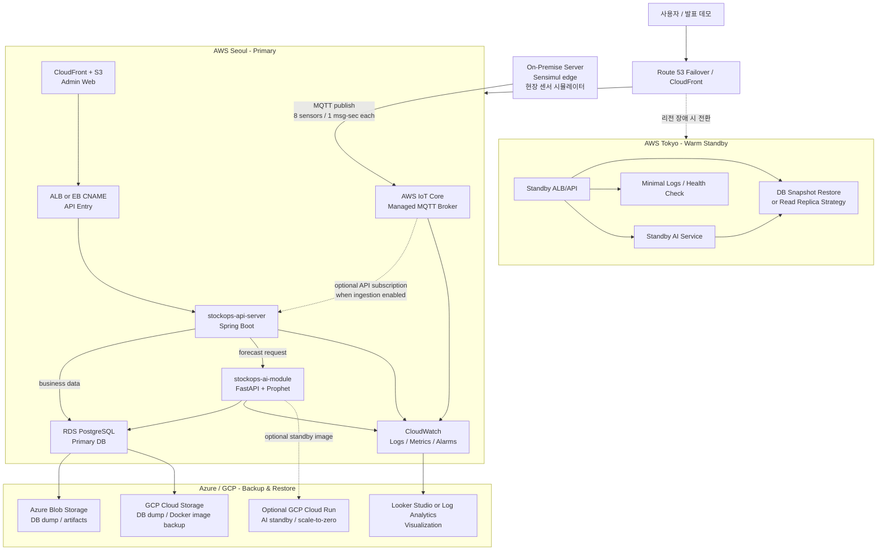
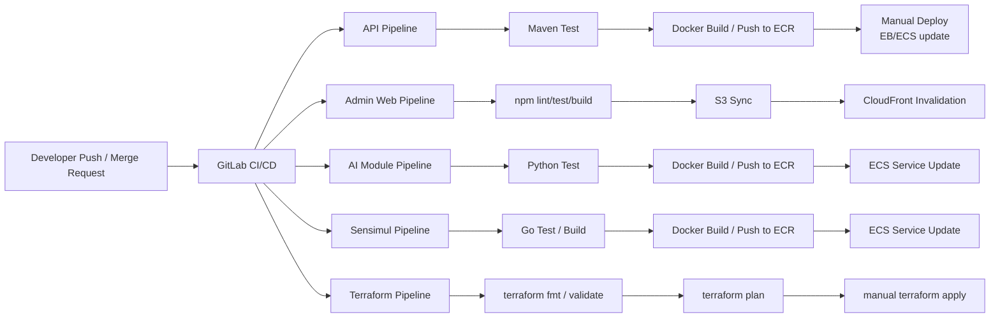
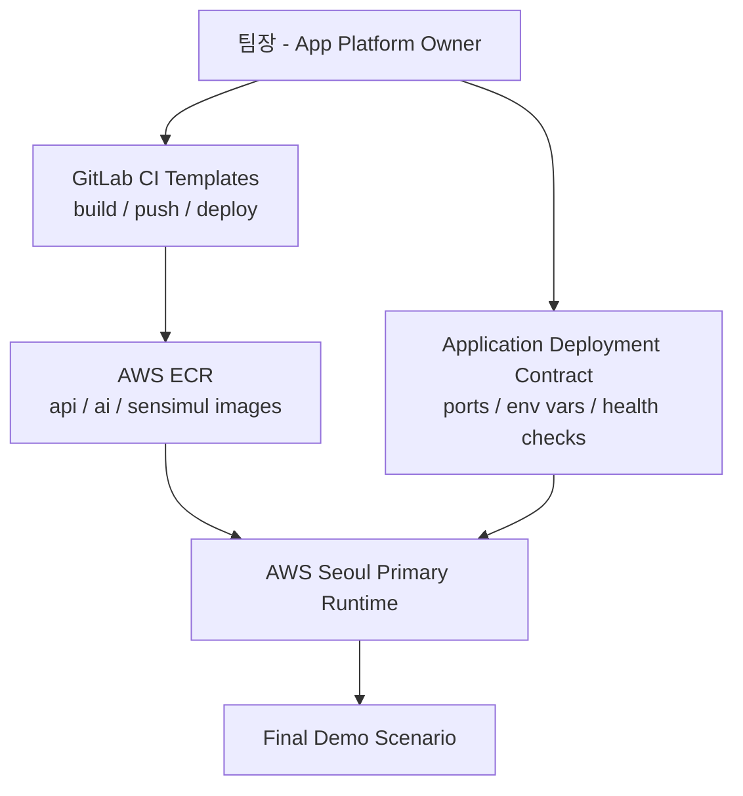
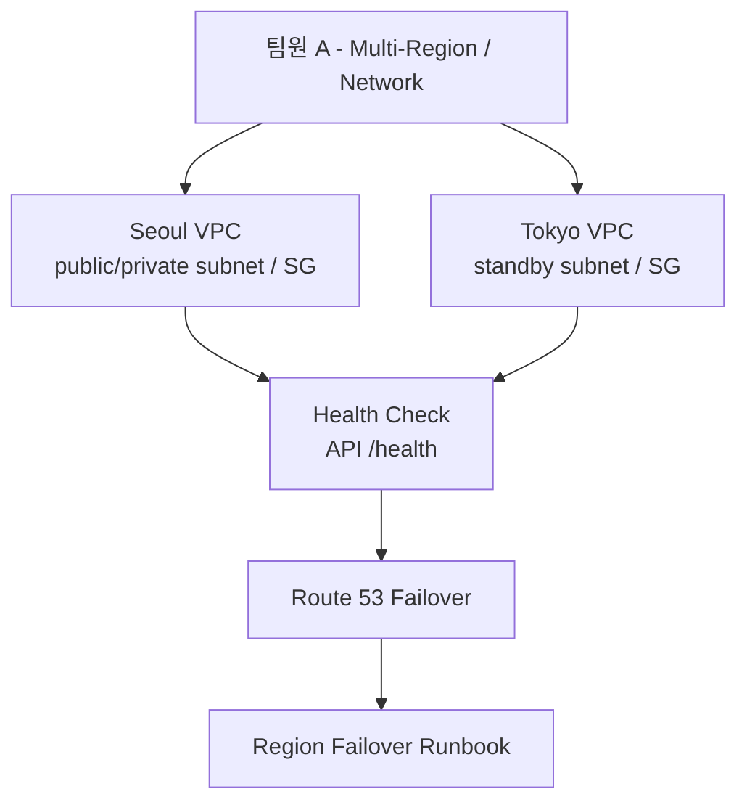
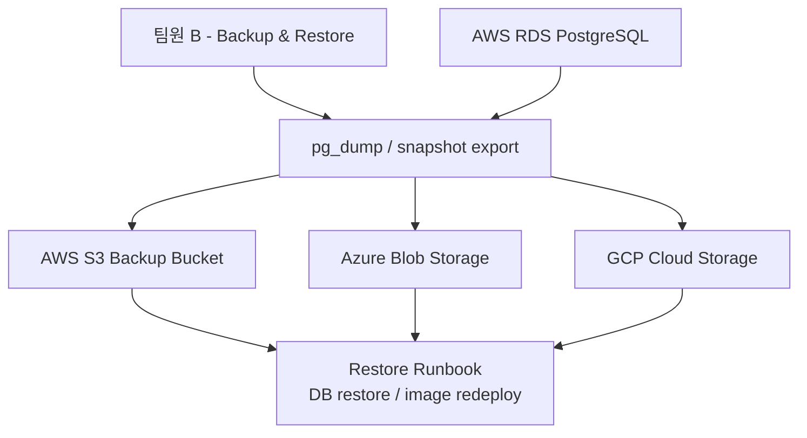
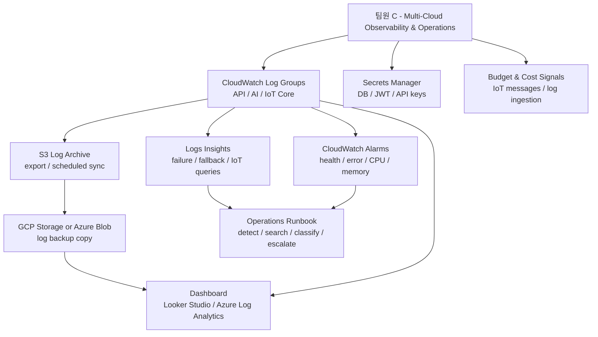

# StockOps Hybrid Multi-Cloud Meeting Brief

작성일: 2026-05-19  
목표 발표 시점: 2026년 6월 셋째 주  
대상 시스템: StockOps + Sensimul + stockops-ai-module

## 1. 회의 목적

StockOps 팀 프로젝트는 단순 애플리케이션 배포가 아니라, 온프레미스와 AWS, Azure, GCP를 활용한 하이브리드 멀티 클라우드 서비스 설계를 목표로 한다.

이번 회의에서는 다음 내용을 결정한다.

- 어떤 클라우드를 Primary, Standby, Backup, Observability 용도로 사용할지
- 멀티리전, 재해복구, CI/CD, AI 모듈을 어디까지 구현할지
- 4명의 팀원이 어떤 구조와 기능을 주로 맡을지
- Terraform과 서비스별 배포 방식을 어떻게 분리할지

## 2. 현재 프로젝트 구성

| 저장소 | 역할 | 주요 기술 | 배포 방향 |
|---|---|---|---|
| `stockops-api-server` | 재고/출고/발주/AI 추천 API | Spring Boot, PostgreSQL, Docker | AWS Primary API |
| `stockops-admin-web` | 관리자 웹 | React, Vite, TypeScript | S3 + CloudFront |
| `Sensimul` | 현장 센서 데이터 시뮬레이터 | Go, MQTT, SQLite, Docker | 온프레미스 edge |
| `stockops-ai-module` | 수요예측 AI 마이크로서비스 | FastAPI, Prophet, PostgreSQL | ECS Fargate 또는 Cloud Run standby |
| `stockops-cloud` | 인프라/IaC/배포 문서 | Terraform, scripts | 공통 인프라 관리 |

## 3. 추천 최종 방향

3주 안에 구현과 발표를 모두 끝내야 하므로, 전체 멀티클라우드 Active-Active보다는 계층형 DR 구조를 추천한다.

핵심 전략은 다음과 같다.

1. AWS Seoul을 Primary 운영 리전으로 사용한다.
2. AWS Tokyo를 Active-Passive Warm Standby 리전으로 사용한다.
3. Azure/GCP는 Backup & Restore, 아티팩트 보관, 보조 AI/로그 시각화 역할로 사용한다.
4. 온프레미스는 Sensimul edge와 장애 시뮬레이션 역할을 맡는다.
5. 핵심 쓰기 데이터는 Primary DB 기준으로 관리하고, 전체 Active-Active는 향후 확장안으로 발표한다.

## 4. 전체 아키텍처



센서 데이터 흐름은 `온프레미스 Sensimul -> AWS IoT Core -> API Server`가 기준이다. Sensimul은 현장 센서에서 들어오는 값을 시뮬레이션하는 edge 역할로 보고 온프레미스에 둔다. API 서버가 MQTT ingestion을 활성화했을 때만 IoT Core MQTT endpoint를 구독해 센서값을 받아오며, 센서 스트림은 기본적으로 RDS 저장 대상이 아니다. RDS는 재고, 출고, 입고, 발주, 사용자, AI 추천 등 업무 데이터를 저장하는 Primary DB로 본다.

기존 Mosquitto on ECS는 구현이 단순한 대안으로 남긴다. 최종 설계에서는 관리형 서비스 활용, 인증서 기반 디바이스 인증, 운영 부담 감소를 위해 AWS IoT Core를 우선안으로 둔다.

### 센서 메시지 비용 추정

전제:

- 센서 8개
- 센서당 초당 1회 publish
- 30일 연속 실행

```text
8 sensors * 1 msg/sec = 8 msg/sec
1 hour = 28,800 messages
1 day = 691,200 messages
30 days = 20,736,000 messages
```

AWS IoT Core 메시징 비용을 단순 publish 기준 약 `$1 / 1M messages`로 보면 월 약 `$20.74` 수준이다. API 서버가 같은 메시지를 subscribe하면 전달 메시지까지 포함되어 대략 2배 수준으로 잡아 월 약 `$40` 전후까지 볼 수 있다. IoT Rule, Lambda, CloudWatch payload logging을 붙이면 추가 비용이 발생한다.

비용 절감 전략:

- 발표/테스트 시간에만 Sensimul 실행
- 센서 8개를 1초마다 개별 publish하지 않고 batch publish로 묶기
- 테스트 환경에서는 1초 주기 대신 5초 또는 10초 주기 사용
- IoT Rule은 필요한 topic에만 적용
- CloudWatch payload logging은 기본 비활성화
- AWS Budget alarm으로 비용 초과 감지

## 5. DR 전략

| 장애 범위 | 대응 방식 | 구현 난이도 | 발표 포인트 |
|---|---|---:|---|
| 인스턴스/Task 장애 | ALB, EB/ECS health check, restart | 낮음 | 기본 가용성 |
| AZ 장애 | Multi-AZ subnet, ALB, RDS Multi-AZ 선택 | 중간 | 고가용성 설계 |
| AWS Seoul 리전 장애 | AWS Tokyo Warm Standby + Route 53 Failover | 중간 | 멀티리전 DR |
| AWS 전체 장애 | Azure/GCP Backup & Restore | 중간 | 멀티클라우드 DR |
| AI 서비스 장애 | API circuit breaker + statistical fallback | 낮음 | 서비스 graceful degradation |
| IoT/Sensor 장애 | On-prem Sensimul 재전송/복구 시나리오 | 중간 | 하이브리드 edge |

## 6. Active-Active에 대한 판단

전체 Active-Active는 최종 지향점으로는 좋지만, 이번 프로젝트의 실제 구현 범위로는 위험하다.

특히 StockOps는 재고, 출고, 입고, 발주 승인처럼 쓰기 정합성이 중요한 데이터가 많다. 여러 클라우드에서 동시에 쓰기를 받으면 재고 수량 충돌, 중복 발주, 승인 상태 불일치 문제가 생긴다.

따라서 이번 프로젝트에서는 다음처럼 구분한다.

| 영역 | 권장 운영 방식 |
|---|---|
| Admin Web 정적 파일 | Active-Active 가능 |
| AI 예측 서비스 | Active-Active 또는 Standby 가능 |
| 로그/대시보드 | Multi-cloud 복제 가능 |
| 센서 데이터 수집 버퍼 | 향후 Active-Active 가능 |
| 재고/출고/발주 쓰기 API | Active-Passive 권장 |
| PostgreSQL Primary DB | Primary-Standby 권장 |

발표 메시지:

> 무상태 서비스와 읽기 중심 서비스는 멀티클라우드 Active-Active로 확장 가능하게 설계하고, 재고/발주처럼 정합성이 중요한 쓰기 트랜잭션은 Primary-Standby로 제한한다.

## 7. CI/CD 전략

GitLab CI/CD를 중심으로 서비스별 빌드와 배포를 분리한다.



권장 원칙:

- CI는 자동으로 실행한다.
- CD는 발표 환경 안정성을 위해 manual approval을 둔다.
- Terraform apply, destroy는 반드시 수동으로 실행한다.
- 배포 이미지는 `dev`, `stage`, commit SHA 태그를 같이 관리한다.
- Primary와 Standby는 같은 Docker image를 사용한다.

## 8. Terraform과 앱 배포의 책임 분리

Terraform으로 모든 앱 릴리즈까지 처리하는 방식은 팀 프로젝트에서 병목이 될 수 있다. 대신 다음처럼 분리한다.

| 영역 | 권장 방식 |
|---|---|
| VPC, Subnet, Route Table | Terraform |
| Security Group, IAM | Terraform |
| RDS, ECR, S3, CloudFront | Terraform |
| ECS Cluster, EB/ECS Service 골격 | Terraform |
| CloudWatch Log Group, Alarm | Terraform |
| Docker image build/push | GitLab CI/CD |
| API/Admin/AI 릴리즈 | GitLab CI/CD 또는 deploy script |
| Sensimul edge 실행 | On-premise script 또는 systemd |
| DB dump, Azure/GCP 백업 복제 | script + CI schedule |
| Terraform apply/destroy | manual job |

발표 메시지:

> Terraform은 재현 가능한 클라우드 인프라를 담당하고, 애플리케이션 릴리즈는 GitLab CI/CD와 서비스별 배포 스크립트로 분리한다. 이를 통해 인프라 변경과 애플리케이션 변경의 책임을 나누고, 각 팀원이 맡은 서비스 단위로 빠르게 배포·검증할 수 있도록 설계했다.

## 9. 팀원별 역할 및 산출물

### 팀장 / 애플리케이션 배포 및 통합

주요 책임:

- API, Admin Web, AI Module의 배포 표준 정의
- 온프레미스 Sensimul의 MQTT 연결 기준 정의
- GitLab CI/CD 공통 규칙 정의
- AWS Seoul Primary 배포 통합
- `STOCKOPS_AI_SERVICE_URL`, MQTT URL, DB URL 등 서비스 간 연결값 관리
- 최종 데모 흐름 구성

만들어야 할 구조:



필수 산출물:

- 서비스별 포트/환경변수/헬스체크 표
- API/Admin/AI 배포 순서와 Sensimul 연결 순서
- GitLab CI/CD 기본 템플릿 또는 예시
- 최종 데모 체크리스트

### 팀원 A / AWS 멀티리전 및 네트워크/Failover

주요 책임:

- AWS Seoul/Tokyo 네트워크 구조 설계
- ALB/EB/ECS health check
- Route 53 Failover 설계
- Warm Standby 전환 시나리오

만들어야 할 구조:



필수 산출물:

- Seoul/Tokyo 리전 구조도
- Route 53 failover 정책
- 리전 장애 시 전환 절차
- RTO/RPO 목표값 초안

### 팀원 B / Backup & Restore 및 멀티클라우드 DR

주요 책임:

- RDS dump/snapshot 백업 전략
- Azure Blob, GCP Cloud Storage 백업 저장소 구성
- 복구 스크립트 또는 수동 Runbook 작성
- AWS 전체 장애 시 복구 절차 설계

만들어야 할 구조:



필수 산출물:

- 백업 주기와 보관 기간
- Azure/GCP 백업 저장소 구성
- DB 복구 절차
- 장애 유형별 복구 순서

### 팀원 C / Multi-Cloud Observability & Operations

주요 책임:

- CloudWatch Logs, Metrics, Alarm
- CloudWatch Logs Insights 쿼리 작성
- AWS S3 Log Archive 구성
- GCP Cloud Storage 또는 Azure Blob으로 로그 아카이브 복제
- BigQuery + Looker Studio 또는 Azure Log Analytics 기반 로그 시각화
- API, AI, IoT Core, DR 테스트, 배포 로그 분류
- 장애 분석 Runbook 작성
- Secrets Manager, IAM 최소권한 정책
- IoT 메시지 수, CloudWatch 적재량, Budget 비용 감시
- 발표용 비용 비교표

만들어야 할 구조:



필수 산출물:

- 로그 그룹/알람 목록
- Logs Insights 쿼리 세트
- S3 로그 아카이브 경로
- GCP 또는 Azure 로그 백업 경로
- 멀티클라우드 로그 시각화 화면
- 장애 알람 기준
- Secret 관리 방식
- 비용 절감 전략과 예상 비용표
- 장애 분석 Runbook

추천 장애 로그 시나리오:

- AI Module 장애: API fallback 로그와 AI failure count 확인
- IoT 인증 실패: IoT Core 인증 실패 로그와 보안 이벤트 확인
- Sensimul 중단: IoT 메시지 수 감소와 마지막 publish 시각 확인
- AWS 장애 가정: GCP/Azure에 복제된 로그 아카이브에서 장애 직전 로그 확인
- 배포 실패: GitLab CI/CD 로그와 CloudWatch 배포 로그를 함께 확인

## 10. 애플리케이션 배포 계약서 초안

팀원들이 앱 내부 로직을 몰라도 Terraform을 구현할 수 있도록, 애플리케이션 담당자가 다음 계약서를 제공한다.

| 서비스 | 포트 | Health Check | 외부 노출 | 주요 환경변수 |
|---|---:|---|---|---|
| `stockops-api-server` | 8080 | `/actuator/health` | Public ALB/CloudFront | `STOCKOPS_DATASOURCE_URL`, `JWT_SECRET`, `STOCKOPS_AI_SERVICE_URL`, `STOCKOPS_MQTT_INGESTION_BROKER_URL` |
| `stockops-admin-web` | 80/static | `/` | CloudFront | `VITE_API_BASE_URL` |
| `stockops-ai-module` | 8000 | `/health` | Private 권장 | `DATABASE_URL`, `MODEL_CACHE_TTL_SECONDS`, `MIN_HISTORY_DAYS` |
| `Sensimul` | none or 8080 web | optional | On-premise | `SENSIMUL_MQTT_BROKER_URL`, `SENSIMUL_SITE_ID`, `SENSIMUL_MODE` |
| `AWS IoT Core` | 8883/443 | managed | AWS managed | Thing, certificate, IoT policy, topic rule |
| `RDS PostgreSQL` | 5432 | managed | Private | DB name/user/password |

## 11. 3주 실행 계획

### 1주차: Primary 배포 완성

- AWS Seoul Terraform dev/stage 환경 정리
- API, Admin Web, RDS 배포 성공
- 온프레미스 Sensimul -> AWS IoT Core -> API 데이터 흐름 확인
- AI Module Docker build 및 API 연동 확인
- GitLab CI build/push 기본 구성

### 2주차: DR/멀티리전/백업 구현

- AWS Tokyo Warm Standby 골격 구성
- Route 53 failover 설계 또는 시뮬레이션
- RDS dump/snapshot 백업 절차 작성
- Azure/GCP 백업 저장소 구성
- CloudWatch 로그/알람 구성

### 3주차: 발표 안정화

- 장애 시나리오 리허설
- AI fallback 데모 준비
- 비용표와 설계 의도 정리
- 팀원별 발표 파트 확정
- 최종 아키텍처 다이어그램과 복구 Runbook 정리

## 12. 회의에서 결정해야 할 사항

- AWS Tokyo standby를 실제로 켤지, 문서/부분 구현으로 둘지
- Azure와 GCP 중 어떤 쪽에 실제 백업을 구현할지, 둘 다 할지
- AI Module을 AWS ECS에만 둘지, GCP Cloud Run standby까지 둘지
- Terraform 모듈 구조를 누가 정리할지
- GitLab CI/CD에서 deploy까지 자동화할지, manual deploy로 둘지
- 발표 데모에서 실제 장애 전환을 보여줄지, 구조도와 Runbook 중심으로 보여줄지

## 13. 추천 발표 메시지

> StockOps는 AWS Seoul을 Primary 운영 환경으로 사용하고, AWS Tokyo를 Warm Standby 리전으로 구성해 리전 장애에 대비한다. Azure와 GCP에는 백업본과 배포 아티팩트를 복제해 AWS 전체 장애 상황에서도 복구 가능한 구조를 만든다. 애플리케이션 릴리즈는 GitLab CI/CD로 자동화하고, Terraform은 네트워크, 보안, DB, 로그, 백업 등 재현 가능한 인프라를 관리한다. AI 예측 서비스는 독립 마이크로서비스로 분리하고 장애 시 통계 모델로 fallback하여 서비스 중단 범위를 줄인다.
